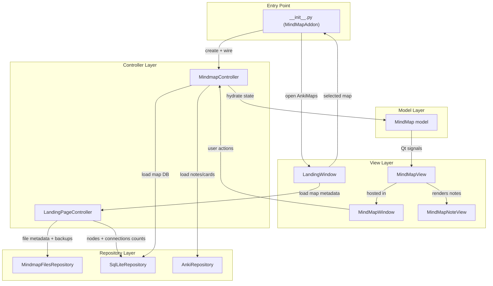

# AnkiMaps Technical Overview

This document covers the technical structure of the AnkiMaps add-on.

## Architecture Style

AnkiMaps follows an MVC-ish separation:

- View: `src/view/` (PyQt widgets, windows, graphics items)
- Controller: `src/controller/` (use-case orchestration and business flow)
- Model: `src/model/` (in-memory mindmap state + Qt signals)
- Repository: `src/repository/` (Anki and SQLite/file-system IO)

## Architecture Diagram

## Entry Point

- `__init__.py`
  - Registers menu actions and hooks.
  - Opens landing UI.
  - Wires view signals to controllers.
  - Handles window lifecycle and cleanup.

## Core Runtime Flow

1. User opens AnkiMaps from the Tools menu.
2. `LandingPageController` aggregates map metadata from repositories.
3. `LandingWindow` lets the user pick/create/manage a map.
4. `MindmapController` loads and hydrates the model from SQLite + Anki notes.
5. `MindMapWindow` + `MindMapView` render/edit nodes and connections.
6. Controller persists changes through repositories.

## Data Layer

- `AnkiRepository`
  - Reads notes/cards/decks from Anki collection APIs.
- `SqlLiteRepository`
  - Stores map nodes and connections in per-map SQLite files.
- `MindmapFilesRepository`
  - File-system metadata around mindmap DB files and backups.

## Persistence Model

Each mindmap is a dedicated SQLite file under:

- `addons21/AnkiMaps/user_files/mindmaps/<map_name>.db`

Backups are stored under:

- `addons21/AnkiMaps/user_files/backups/<map_name>/`

## Packaging

- Packaging script: `package.py`
- Output: `dist/AnkiMaps_<version>.ankiaddon`
- Included root docs in package:
  - `README.md`
  - `LICENSE.txt`

`ARCHITECTURE.md` is repository-only documentation and is not packaged.
